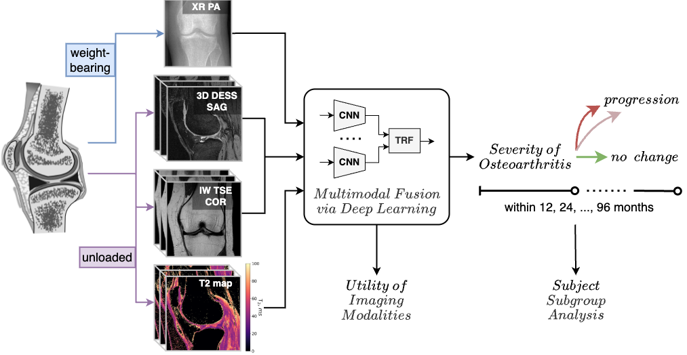

# koafusion - Knee Osteoarthritis Progression Prediction from Multimodal Data

Source code accompanying the publication in the IEEE Journal of Biomedical and Health Informatics, https://ieeexplore.ieee.org/abstract/document/10857277:

<p align="center">
 
</p>

### Description

1. The code requires the OAI Baseline/00m dataset - textual variables, knee XR (PA) and MR images
 (SAG 3D DESS, COR IW TSE, SAG T2 mapping).

2. See `runner.sh` for the steps required to set up the environment and reproduce the experiments.

3. The structure of the original project is as follows:
    ```
    project/
      | data/
        # -- Raw OAI data
        | OAIBaselineImages/
        | OAI_general/
          | OAI_CompleteData_ASCII/
          | OAI_CompleteData_SAS/       
          | contents/{00m,12m,...}.csv 
        # -- Custom data (available upon reasonable request)
        | OAI_XR_ROIs  # knee ROIs extracted from XR images   
        | tiulpin2019multimodal__labels.csv  
        # -- Extracted from `OAIBaselineImages` by `Targets_meta_and_scans_from_OAI.ipynb`
        | OAI_SAG_3D_DESS_raw/
        | OAI_COR_IW_TSE_raw/
        | OAI_SAG_T2_MAP_raw/
        # -- Preprocessed data
        | OAI_Clin_prep/  # generated by `Targets_meta_and_scans_from_OAI.ipynb`
          | meta_base.csv
        | OAI_SAG_3D_DESS_prep/  # generated by `prepare_data_mri_oai.py`
          | meta_base.csv
        | OAI_COR_IW_TSE_prep/  # ---//--- 
        | OAI_SAG_T2_MAP_prep/  # ---//---
        | OAI_XR_PA_prep/  # generated by `prepare_data_xr_oulu.py` from `OAI_XR_ROIs`
        | meta_extract__sag_3d_dess.csv  # generated by `Targets_meta_and_scans_from_OAI.ipynb`
        | meta_extract__cor_iw_tse.csv  # ---//--- 
        | meta_extract__sag_t2_map.csv  # ---//---
        | meta_agg_oai.csv  # generated automatically by `_dataset.py`
      # -- This repository
      | src/
      # -- Model weights, intermediate and final results   
      | results/ 
        | experiment_0/
          | weights/
          | ...
        | experiment_1/
        | ...
    ```

### Legal aspects

This code is freely available for research purposes.

The software has not been certified as a medical device and, therefore, must not be used
for diagnostic, prognostic, or any similar purposes in real clinical scenarios.

Commercial use of the code is prohibited. For inquiries, please contact the authors.

### Cite this work

```
@article{panfilov2025end,
  title={End-To-End Prediction of Knee Osteoarthritis Progression With Multimodal Transformers},
  author={Panfilov, Egor and Saarakkala, Simo and Nieminen, Miika T and Tiulpin, Aleksei},
  journal={IEEE Journal of Biomedical and Health Informatics},
  year={2025},
  publisher={IEEE}
}
```
